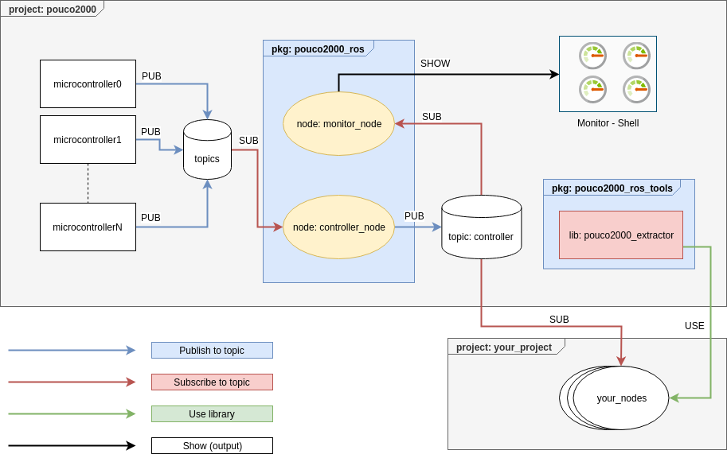
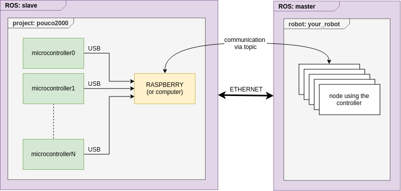
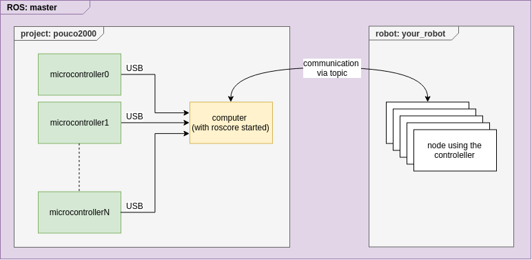

# Pouco2000  <!-- omit in toc --> 

:warning: in development

related commit: [2a0978f](https://github.com/PoussPouss/pouco2000/tree/2a0978fc0e16d941215a3b3b50db7ed5f9754e0e)

## Table Of Contents  <!-- omit in toc --> 

- [ROS Packages](#ros-packages)
  - [Architecture](#architecture)
    - [pkg: pouco2000_ros](#pkg-pouco2000ros)
    - [pkg: pouco2000_ros_tools](#pkg-pouco2000rostools)
  - [Setup packages](#setup-packages)
    - [Place its](#place-its)
    - [Compile its](#compile-its)
  - [Use packages](#use-packages)
    - [Start the controller](#start-the-controller)
    - [Start the monitor (Opt)](#start-the-monitor-opt)
    - [msg:Controller](#msgcontroller)
    - [lib: pouco2000_extractor](#lib-pouco2000extractor)
  - [Documention](#documention)
- [Arduino Library](#arduino-library)
  - [Setup library](#setup-library)
    - [Place it](#place-it)
    - [Place ros_lib](#place-roslib)
  - [Use library](#use-library)
  - [Warning](#warning)
- [Modelization](#modelization)
- [Examples](#examples)
- [Configurations](#configurations)
  - [Remote](#remote)
  - [Local](#local)
   
## ROS Packages

### Architecture

Diagram explaining the principal workflow. 

   

ROS packages are splitted into 2 meta-packages: 
- *pouco2000_src*: set of packages driving the controller
  - pouco2000_ros
  - pouco2000_msgs
  - pouco2000_tools
- *pouco2000_examples*: set of packages explaining how to use the project 
  - pouco2000_popup
  - pouco2000_gazebo
  - pouco2000_demo 

#### pkg: pouco2000_ros

the principale package is *pouco2000_ros*, this package receives data from electronic part, and regroups these messages into one msg. 

The package is generally based on 2 librairies:
- *pouco2000*, principal library, grouping Controller class definition. 
- *pouco2000_debug*, allowing to develope easily the ros part. I decided to let this part in the release version, allowing to user to develope efficacely dependent packages.

2 others libaries have been developed. 
- pouco2000_introspection, filter data from controller msg and publish data 
- pouco2000_monitor, grouping methods and classes allowing to create a monitor.

#### pkg: pouco2000_ros_tools

This package exposes a cpp library, easily the developement of nodes using this project. 

### Setup packages

#### Place its 

ROS packages need to placed inside your ROS workspace. It's possible to place its, by a symbolic link. 

``` shell
USER$ ln -s {this/ros/folder/path} {ros_ws/path}
```

(It's also possible to copy and paste the folder inside your workspace)

#### Compile its

Once moved or linked, the package need to be compiled. It's possbile to use catkin_make or catkin build. 

```shell
** go inside in your working space (at the root level) **
USER$ catkin_make 
```
or 
```shell
** go inside in your working space (at any level) **
USER$ catkin build 
```

### Use packages

> The controller_node publishes the current state of the table. If you want to get the current state you need to create a subscriber to this topic. By default this topic is: *controller*

#### Start the controller 

Please update the launch *release* inside pouco2000_ros package (verify serial port used).

```shell 
USER$ roslaunch pouco2000_ros release.launch
```

#### Start the monitor (Opt)  

The monitor displays (in the current shell) the current state of the board seen from ROS.  

The node is start by this way: 

```shell
USER$ roslaunch pouco2000_ros monitor.launch
```

(launch the node in the good namespace)


or by this way (remapping):

```shell
USER$ rosrun pouco2000_ros monitor_node controller:=/namespace/controller
```

#### msg:Controller 

The project is essentially based on a principal msg: *pouco2000::Controller*

```
Header header
Buttons buttons
SwitchsOnOff switchs_on_off
SwitchsMode switchs_mode
Potentiometers potentiometers_circle
Potentiometers potentiometers_slider
```

Each part expect header is an array of data. 

The message can be see like this: 

```
Header header
[bool,bool,...] buttons
[bool,bool,...] switchs_on_off
[uint8,uint8,...] switchs_mode
[float32,float32,...] potentiometers_circle
[float32,float32,...] potentiometers_slider
```

#### lib: pouco2000_extractor  

The package pouco2000_tools includes pouco2000_extractor. This library provides class and methods allowing to extract data easily from controller msg. 

For each field a class has been developed. For each extractor a position in the field array need to be given. 

Each extractor owns no less than 2 methods: 

```c++
/**
* @brief extract the value from msg only if the data has been updated 
* 
* @param msg controller msg 
* @param result result of the extraction 
* @return true trig an update  
* @return false update hasn't been done  
*/
bool extract_only_change(const pouco2000_ros_msgs::Controller::ConstPtr& msg, T_data& result);

/**
* @brief extract the value if it's possible to do
* 
* @param msg controller msg 
* @param result result of the extraction 
* @return true extraction is possible 
* @return false extraction isn't possible 
*/
bool extract(const pouco2000_ros_msgs::Controller::ConstPtr& msg, T_data& result);

```

| Field               | Class                        | Additional Method | Goal                                           |
| ------------------- | ---------------------------- | ----------------- | ---------------------------------------------- |
| Buttons             | ExtractorButton              | is_push           | return bool if the button is pushed            |
| SwitchOnOff         | ExtractorSwitchOnOff         | is_on             | return bool if the switch is on                |
| SwitchMode          | ExtractorSwitchMode          | is_mode           | return bool if the switch is on the mode given |
| PotentiometerCircle | ExtractorPotentiometerCircle | None              | None                                           |
| PotentiometerSlider | ExtractorPotentiometerSlider | None              | None                                           |


> Show example *demo_02_extractor* inside *pouco2000_demo* package. 

> Show the documentation inside the *pouco2000_demo_tools* package (once compiled).


:exclamation: If you want to use this library inside your package, your package need to depend on:
*pouco2000_ros_tools* (CMakeLists and package.xml)

### Documention 

a *rosdoc* command has been added to the CMakeLists, so when you will compile the package, a documentation folder will be added to package including a doxygen documentation.

## Arduino Library 

An arduino library has been developed, allowing to create easily a code.

### Setup library 

#### Place it 

Like ROS package, the library need to be placed at the good place. It's possible to create a symbolic link.  

```shell 
USER$ ln -s {arduino_lib/path} {arduino/path/libraries/}
```

#### Place ros_lib

The project uses ROSSERIAL package. Once the *pouco2000_ros_msgs* has been compiled, the header's msgs need to placed into arduino libraries. 

The lib_ros generation can be done, by this command: 

```shell
USER$ rosrun rosserial_arduino make_libraries.py {arduino/path/libraires}
```

For more information about this package: [http://wiki.ros.org/rosserial](http://wiki.ros.org/rosserial) 

### Use library  

For each field (buttons, switchs on off...), a handle object need to be created.  

```C++
/**
 * @brief Construct a new Handle object
 * 
 * @param topic topic where the message will be published
 * @param connections array of connections
 * @param n_connections number of connections 
 * @param is_digital if the field use digital or analog port 
 */
Handle<T_field,T_data,T_msg>::Handle(const char* topic,int* connections,int n_connections,bool is_digital)
```
In the setup method, the handle need to call a setup method. 

```C++
/**
 * @brief setup the current handle, declare the publisher to the NodeHandle and 
 * set the pinMode of each pin to INPUT  
 * @param nh current nodehandle 
 */
void setup(ros::NodeHandle& nh);
```

In the loop method, the handle need to call a update method.

```C++ 
/**
* @brief update msg used by the handle in checking state of pin 
* 
*/
void update();
```

In the libraray, typical typedefs are already defined. 

```C++

typedef Handle<Switch,pouco2000_ros::SwitchsOnOff::_data_type,pouco2000_ros::SwitchsOnOff> HandleSwitchsOnOff;

typedef Handle<SwitchMode,pouco2000_ros::SwitchsMode::_data_type,pouco2000_ros::SwitchsMode> HandleSwitchsMode;

typedef Handle<Button,pouco2000_ros::Buttons::_data_type,pouco2000_ros::Buttons> HandleButtons;

typedef Handle<Potentiometer,pouco2000_ros::Potentiometers::_data_type,pouco2000_ros::Potentiometers> HandlePotentiometers;
```

So, for each field you need:
1. varibales definition (outside of setup and loop method) 
   1. create a pin array, defining pin used by this field
   2. create a handle for this field
2. inside setup method 
   1. call the setup of the handle with the current nodehandle
3. inside loop method: 
   1. call the update method of the handle 

> Some examples has been developed and added to the librarie. Theses examples can be loaded from the arduino IDE (file -> Examples -> pouco2000_ard). 

### Warning 
The library has been developed and tested on the following boards: 
- arduino uno
- arduino nano 

It's possible to use several microcontrollers, but all elements of a field neet to be driven by the same microcontroller.

## Modelization 

## Examples  

## Configurations 

Several configurations are possible with Pouco2000: 

### Remote

You can plug all microcontrollers to a raspberry or a computer (ROS SLAVE) and connect this computer to your ROS MASTER. By this way it's possible to communicate with your robot via ethernet (or wifi).




For more information about ROS slave/master: http://wiki.ros.org/ROS/Tutorials/MultipleMachines

### Local 

An another way, it's to connect directly microcontroller to your computer running the ROS MASTER.  

